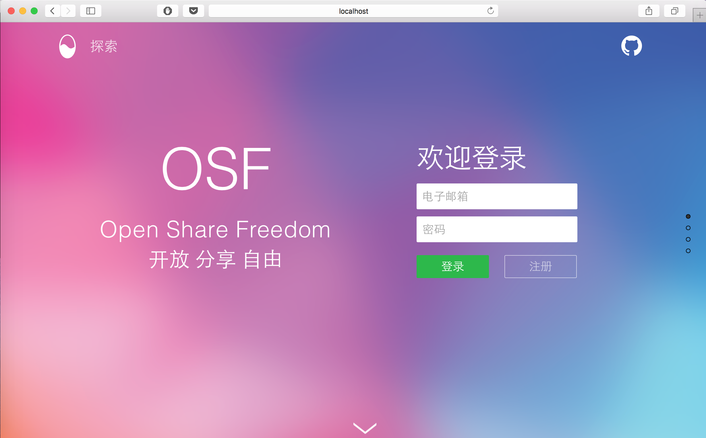
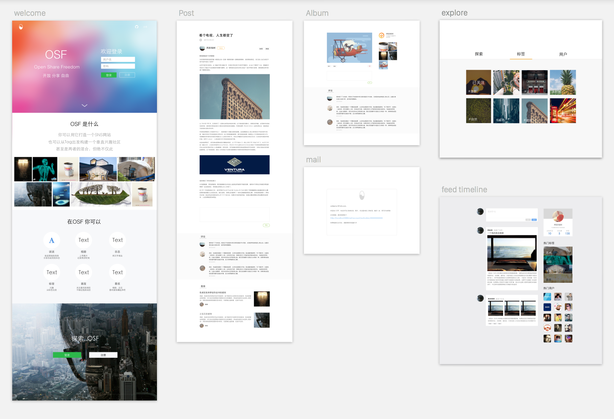

## Django_SNS

Django SNS的灵感来自于[OSF](https://github.com/lvwangbeta/osf)，OSF是一个的开放、自由、分享的内容社区类网站原型。拥有绝大多数的社交类网站、内容分享类、社区类、兴趣垂直类网站共同的特性，如多用户，内容的发布、评论、喜欢，消息传递，Feed流，标签分类等等。

然而OSF是基于JAVA语言，这里参考OSF重新造了一个轮子，使用Django框架实现

前端所有代码来自OSF，目前只是重写了后端，尽量实现原来的功能

OSF参考网站[http://osf.coding.io/welcome](http://osf.coding.io/welcome)

## 目前主要功能 

* 多用户、用户间互相关注
* 标签系统
- Feed流  
  * 关注用户Feed
* 说说、日志、相册
* 评论、回复
* 通知系统  

* 上传图片云存储

##  UI

Sketch文件下载:[osf_sketch](http://pan.baidu.com/s/1hq5zI1e)  

## 技术选型 

Django SNS 选择Django作为后端基础框架，实现RESTFull url，为实现尽可能的前后端分离，除首屏数据渲染外均通过Ajax+json形式更新前端，url设计与数据交互规范见 [url设计与数据交互说明](doc/url.md)

Django SNS使用了South专门做数据库表结构自动迁移工作，初始化需要执行

	py manage.py syncdb
	py manage.py migrate

如果需要添加其他的models
第一次需要执行

	py manage.py schemamigration app_name  --init
以后改变模型后只要执行	

	py manage.py schemamigration app_name  --auto
	py manage.py migrate app_name
	

Django SNS 借助于Django REST framework实现了API接口访问

Django SNS 借助django-userena实现了用户系统，包括登陆，注册，激活，头像，个性签名等功能
初始化需要执行

	py manage.py check_permissions
	
Django SNS 借助于django-grappelli和django filebrowser实现了美化后台界面和文件管理

MySQL作为Django SNS的关系型数据库，除Feed之外的所有数据均由其存储，[参考OSF表设计](doc/osf_db.png)

由于使用Django内置缓存系统接口，原则上你可以用Redis或者Memcached，这里使用Memcached，主要缓存用户信息、统计计数，同时存储用户的Feed信息流，设置了10分钟失效

## 配置

    找到requirements.txt
    输入下面命令完成python环境初始化
    
    	pip install -r requirements.txt

	#qiniu

## 后续版本计划
目前的版本很不完善

* 关注标签
* 个人信息设置、账户安全
* 邮箱注册激活验证 
* 下个版本将率先实现OAuth登陆
* 搜索功能  
* 发送链接 

## License GPL

Copyright (C) 2015 Django SNS

This program is free software: you can redistribute it and/or modify
it under the terms of the GNU General Public License as published by
the Free Software Foundation, either version 3 of the License, or
(at your option) any later version.

This program is distributed in the hope that it will be useful,
but WITHOUT ANY WARRANTY; without even the implied warranty of
MERCHANTABILITY or FITNESS FOR A PARTICULAR PURPOSE.  See the
GNU General Public License for more details.

You should have received a copy of the GNU General Public License
along with this program.  If not, see <http://www.gnu.org/licenses/>.